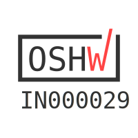

# M19O2
DiY Oxygen Concentrator based on / inspired by the [OxiKit](https://github.com/OxiKit/oxygen-concentrator-how-to-diy-open-source#oxygen-concentrator-how-to-diy-open-source), [OpenOx](https://github.com/hacklabkyiv/openox), [Marut](https://www.technido.com/marut), [RepRap](https://github.com/RepRapLtd/Oxygen-concentrator) and [Project Apollo](https://github.com/oxycon/ProjectApollo) platforms.


## About

Read about the project on [Hackaday](https://hackaday.com/2021/04/26/indian-makers-respond-to-the-covid-19-pandemic-by-producing-oxygen-concentrators/).
Also check out the project on the [hackaday.io](https://hackaday.io/project/181201-m19o2-oxygen-concentrator) project page.

The **M19O2** Oxygen Concentrator is "Open Source Hardware" as certified by the [OSHWA](https://certification.oshwa.org/in000029.html).
OSHWA UID for the M19O2 is **IN000029**
<a href="https://certification.oshwa.org/in000029.html">

## Contribute

You can contribute on the [Ketto fundraiser page](https://www.ketto.org/fundraiser/m19-oxygen-concentrators-make-in-india)

## Coordination lists

- [Notion workspace](https://www.notion.so/M-19-Collective-b44b9d8d7dd14d5d86d417facf0f4141) for the M19 collective.
- [M19O2 Master](https://docs.google.com/spreadsheets/d/1rJZ5P0rF2Or8yu0H8HEPz25RP8kTAXxbNVU87DqD-eM/edit#gid=0) sheet tracks the city-wise coordinators, tools, FAQs etc.
- [BOM M19O2](https://docs.google.com/spreadsheets/d/1gmmdXTP3EQk-4hCGVYj-FxzUMADlT8mw354VPmYt5A4/edit#gid=870920932) sheet lists the master Bill of Materials (BOM) along with city-wise BOM
- [Starting a community lab](https://docs.google.com/document/d/1oR9rhGmbcnoSBjzQCYwE9Anocvr0q5_VmuVkbnycx18/edit?usp=sharing) document and [Build List for Labs](https://docs.google.com/spreadsheets/d/1DynT9Mh8jcV9qHxwFuQxj1fcQQHj_v_ymwpoZD1L23g/edit?usp=sharing) sheet for lab onboarding information and coordination.

## Engineering

- [Labview testbench](engineering/software/M19-oxygen-concentrator-testbench) is a testbench executable developed by [Fracktal Works](https://github.com/FracktalWorks), useful for tuning the performance of your concentrator prototypes.
- [Computer-aided Design/Engineering](engineering/cad-cae) for design, version control and simulation data related to the OxiKit and its iterations. Committed to open-source and open-innovation.
- [Electronics](engineering/electronics) for all things electronics, including comprehensive design and development data of DIY [Oxygen Analyzers](engineering/electronics/oxygen_analysers) and other [subprojects](engineering/electronics/subprojects).

## How to use this repo

Open a terminal on your computer. Run

```bash
git clone https://github.com/MakersAsylumIndia/M19O2 && cd M19O2
git submodule update --init --recursive
```
The repository shall be available on your computer.
To periodically update the contents,

```bash
cd M19O2
git pull
git submodule update --init --recursive
```

## How to contribute to this repository

Fork this repository. You can find the command for this on the top-right of the webpage. This shall create a personal, updateable copy of this repository on your github account.

On your computer terminal, run

```bash
git clone https://github.com/<your-username>/M19O2 && cd M19O2
git submodule update --init --recursive
```
Add your contributions to this repository and save on github.

```bash
cd M19O2
git add .
git commit -m "<your-commit-message>"
git push origin
```

To contribute your work to the M19 Collective, open your repository in a browser and issue a pull request from your repository to the one at [Makers' Asylum](https://github.com/MakersAsylumIndia).

## License

Licenses

<a href="LICENSE.md"></a>

#### Hardware
CERN Open Hardware License Version 2 - Strongly Reciprocal ([CERN-OHL-S-2.0](https://spdx.org/licenses/CERN-OHL-S-2.0.html)).

#### Software
MIT open source [license](http://opensource.org/licenses/MIT).

#### Documentation:
<a rel="license" href="http://creativecommons.org/licenses/by/4.0/"></a><br />This work is licensed under a <a rel="license" href="http://creativecommons.org/licenses/by/4.0/">Creative Commons Attribution 4.0 International License</a>.
